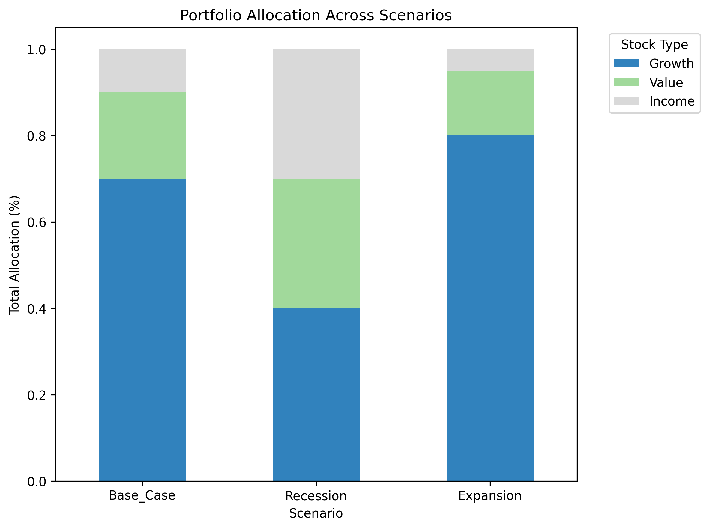

# Quantitative Stock Models: Beating the S&P 500

# Executive Summary

## Purpose
Many investors rely on static rules or single-factor screens, making it difficult to outperform broad benchmarks such as the S&P 500. This project began with the goal of comparing three quantitative approaches to systematic stock selection and portfolio construction: Linear Regression, K-Means clustering, and Bayesian modeling. After evaluating these models on out-of-sample 2023 performance, it became clear that strong returns alone were not enough. The next step was to extend the work by developing a macroeconomic scenario framework that adapts allocations to Recession, Base Case, and Expansion environments.

## Action
The project first analyzed financial data from 2022, engineered fundamental features, and ranked stocks using Linear Regression, K-Means clustering, and Bayesian regression. Stocks were grouped into Growth, Value, and Income categories, and portfolios were constructed and tested against 2023 performance. After observing the strengths and weaknesses of each model, a second phase introduced a macroeconomic scenario allocation engine. This system adjusted portfolio weights based on economic strength, risk appetite, sector rotation, and volatility conditions, producing scenario-specific allocations rather than a single static portfolio.

## Conclusions
Linear Regression delivered the strongest portfolio return at 44.43 percent, significantly outperforming the S&P 500 benchmark of 26.71 percent. K-Means clustering also outperformed with returns of 31.49 percent. Bayesian inference underperformed in this version but highlighted the potential for uncertainty-aware modeling. The second-phase scenario analysis demonstrated that adaptive allocation provides meaningful improvements: 28.33 percent in the Recession scenario, 44.43 percent in the Base Case, and 52.03 percent in the Expansion scenario. These results show that combining stock-selection models with macro-informed allocation strategies produces both resilience and superior performance.

## Evidence
Repository contents:

    quantitative-stock-models/
        cleaned_QuantitativeModels.ipynb    Core analysis: Linear, K-Means, Bayesian models
        dynamic_allocation.ipynb            Supplemental macroeconomic scenario-based allocations
        README.md                           Project overview and results summary
        requirements.txt                    Environment dependencies
        data/                               Optional data storage or external sources
        images/                             Charts and visualizations

---

## 📖 Quick Links
- [Overview](#overview)
- [Objectives](#objectives)
- [Modeling Approaches](#modeling-approaches)
- [Results Summary](#results-summary)
- [Supplemental Analysis: Macroeconomic Scenario-Based Portfolio Allocation (Newly Added!)](#supplemental-analysis-macroeconomic-scenario-based-portfolio-allocation-newly-added)
- [Key Takeaways](#key-takeaways)
- [Key Insights from Scenario Analysis](#key-insights-from-scenario-analysis)
- [Strategic Implications](#strategic-implications)
- [Limitations and Future Directions](#limitations-and-future-directions)
- [Conclusion](#conclusion)
- [Bayesian Inference Primer](#bayesian-inference-primer)
- [Macro Economic Scenario Allocations](#macro-economic-scenario-allocations)
- [🚀 Recent Updates & Enhancements](#-recent-updates--enhancements)
- [Author](#author)
- [References](#references)
- [Project Structure](#project-structure)
- [Requirements](#requirements)

---

## Overview
This project explores quantitative strategies—Linear Regression, K-Means Clustering, and Bayesian Inference—to select stocks and construct portfolios aimed at outperforming the S&P 500 index. Historical stock and financial data from 2022 was analyzed to predict and optimize investment outcomes for 2023, achieving significant market outperformance.

## Objectives
- **Primary Goal**: Develop quantitative investment strategies that reliably outperform the S&P 500 benchmark.
- **Model Comparison**: Evaluate Linear Regression, K-Means Clustering, and Bayesian methods based on predictive accuracy and portfolio returns.
- **Strategic Insight**: Provide actionable insights into stock categorization and strategic portfolio allocation.

---

## Modeling Approaches

### Linear Regression
- **Purpose**: Baseline predictive model identifying stock price drivers.
- **Features**: Financial ratios such as EPS, revenue growth, ROE, dividend yield.
- **Portfolio Strategy**: Allocated 70 percent to Growth stocks, 20 percent to Value stocks, 10 percent to Income stocks.

### K-Means Clustering
- **Purpose**: Unsupervised method identifying natural groupings of stocks.
- **Metrics**: Silhouette Score used for clustering quality.
- **Portfolio Strategy**: Same allocation approach emphasizing Growth stocks.

### Bayesian Inference
- **Purpose**: Probabilistic modeling incorporating prior knowledge.
- **Methodology**: Bayesian regression informed by Linear Regression priors.
- **Challenges**: High computational demands and lower realized returns.

---

## Results Summary

| Model                | Annual Return (2023) | Outperformed S&P 500 (26.71%)? | Key Observations |
|----------------------|----------------------|--------------------------------|------------------|
| **Linear Regression**| **44.43%** 🚀        | ✅ Yes                         | Highest predictive accuracy |
| **K-Means Clustering**| 31.49% 📈           | ✅ Yes                         | Strong clustering; solid returns |
| **Bayesian Inference**| 0.77% 📉            | ❌ No                          | Underperformed; computationally intensive |

---

## Supplemental Analysis: Macroeconomic Scenario-Based Portfolio Allocation (Newly Added!)

In addition to the original quantitative models, a scenario-based portfolio analysis evaluates performance under different economic environments including Base Case, Recession, and Expansion. This demonstrates how adjusting allocations based on economic indicators can improve resilience and amplify returns.

### Supplemental Results (Macroeconomic Scenario Analysis - 2023)

| Economic Scenario | Portfolio Return | Final Portfolio Value (from $10M) | Outperformed S&P 500 (26.71%)? |
|-------------------|------------------|-----------------------------------|--------------------------------|
| **Recession**     | 28.33% 📈        | $12,832,768.71                    | ✅ Yes                         |
| **Base Case**     | 44.43% 🚀        | $14,443,489.52                    | ✅ Yes                         |
| **Expansion**     | 52.03% 🚀        | $15,203,148.33                    | ✅ Yes                         |

### Benchmark Performance (S&P 500 - SPY)

| Benchmark | Return | Final Value (from $10M) |
|-----------|--------|--------------------------|
| **SPY**   | 26.71% | $12,670,922.43           |

---

## Key Takeaways
- Linear Regression was the strongest performer.
- K-Means delivered solid and consistent outperformance.
- Bayesian Inference needs tuning but remains useful for uncertainty-aware modeling.

---

## Key Insights from Scenario Analysis
- Base Case aligns closely with Linear Regression results.
- Expansion scenario returned 52.03 percent, demonstrating strong upside in favorable conditions.
- Recession scenario delivered 28.33 percent, showing resilience and downside protection.

---

## Strategic Implications
- Dynamic Scenario Toggles enable allocation adjustments based on interest rates and volatility.
- Strategic Reallocation highlights shifts between growth, value, and income strategies across macro environments.
- Enhanced Model Flexibility demonstrates adaptability across economic cycles.

---

## Limitations and Future Directions
- Bayesian model requires efficiency improvements.
- More financial features could sharpen predictive accuracy.
- Hybrid or ensemble models may yield superior performance.

---

## Conclusion
This project demonstrates that quantitative strategies can deliver substantial outperformance relative to the S&P 500. Linear Regression provided the strongest results, K-Means clustering delivered consistent gains, and Bayesian inference offers a foundation for future uncertainty-aware models. The macroeconomic scenario analysis shows how dynamic portfolio adjustments can enhance resilience and maximize returns across market conditions.

---

## Bayesian Inference Primer
Bayesian inference models uncertainty explicitly through probability distributions:

p(w | D) ∝ p(D | w) ⋅ p(w)

- p(w): Prior distribution  
- p(D | w): Likelihood from observed data  
- p(w | D): Posterior used for stock selection and risk-aware decisions  

---

## Macro Economic Scenario Allocations



- Dynamic Scenario Toggles adjust classifications based on interest rates and volatility.  
- Strategic Reallocation shifts exposure between growth, value, and income groups.  
- Enhanced Model Flexibility improves robustness across market cycles.

---

## 🚀 Recent Updates & Enhancements
- Added explicit scenario toggling.  
- Dynamic classification thresholds applied.  
- Integrated visualization tools for improved interpretability.

---

## Author
**John Grier**  
MS Data Science Candidate, Illinois Tech  
GitHub: https://github.com/J-Grier

---

## References
- Yahoo Finance historical data  
- Zhao Gao, The application of artificial intelligence in stock investment  
- Wikipedia S&P 500 tickers  

---

## Project Structure

    quantitative-stock-models/
        cleaned_QuantitativeModels.ipynb
        dynamic_allocation.ipynb
        README.md
        requirements.txt
        data/
        images/

---

## Requirements
See requirements.txt for dependencies.

---

## Setup

```bash
git clone https://github.com/J-Grier/quantitative-stock-models.git
pip install -r requirements.txt

